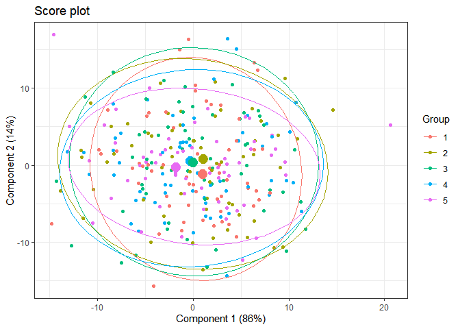

## Introduction

The aim of this repository is to provide an implementation, in R, of the
permutation test for ASCA, which has been proposed recently in
[literature](https://bmcbioinformatics.biomedcentral.com/articles/10.1186/1471-2105-8-322).

## Anova Simultaneous Component Analysis

### Motivation

The need for ASCA comes from the fact that ANOVA is a univariate method
that takes into account that there is an underlying design of the
experiment in the data of interest, but it does not capture the
relationship between the variables that are collected. The opposite is
valid for other multivariate models, such as PCA and SCA, which can
capture the relationship between variables but do not take into account
that there is an experimental design at the source of information. As
these two models only give a limited view, we need a model that takes
into account both aspects of the experiment.

ASCA has been developed exactly for this kind of task and aims to solve
the previously explained problem by merging the estimation aspect of
ANOVA with PCA so that drawbacks of the other methods are not
highlighted.

### Permutation test

ASCA is also thought of as a tool for parameters estimation, just like
ANOVA, which means that we can also test values that are estimated in
the rest part of the process. Unfortunately there is no theoretical
distribution that can be used to compare estimated and tabulated values;
the most appropriate solution, published lately, is the permutation
test, which means that columns of our original dataset are used, a test
statistic is obtained and this process is repeated until a theoretical
distribution is derived. Percentiles of this theoretical distribution
are then used to compare the permuted statistic to the observed one, to
infer about the significance of the parameter.

The test statistic of interest is the following:

$$F=\frac{\frac{SSE\_{red}-SSE\_{full}}{dfe\_{red}-dfe\_{full}}}{\frac{SSE\_{full}}{dfe\_{full}}}$$

## Example

The following examples will use a simulated dataset, which is obtained
from the *simulate.R* script.

Once the dataset has been simulated, the model can be computed and the
variance explained by each variable can be plotted:

As we can see, there is no real effect on the dependent variable, this
happens because values are simulated randomly and categorical features
are not helpful in explaining variability.

We can also plot projections of observations into the latent space
defined by principal component. In particular for the second variable:

The ellipses that should characterize each level inside the second
feature are overlapping because, as said before, values are simulated
and there is no real effect on the dependent variable.

At last, a statistical test for each variable can be carried out and the
distribution of interest, obtained from permutation, can be compared
with the observed test statistic that comes from the original dataset.
As this kind of model has been developed for high-dimensional dataset,
the rising number of dependent variables might imply that the test will
take a few minutes.

Because of that, in this implementation the loop that carries out the
calculations is parallelized with the `doParallel`, in order to use all
cores of the PC.

As expected, the observed test statistic is far from being significant.

## Bibliography

-   [ASCA in One
    Hour](https://www.youtube.com/watch?v=mySaqM7cZ5Q&t=2698s)

-   [Statistical validation of megavariate effects in
    ASCA](https://bmcbioinformatics.biomedcentral.com/articles/10.1186/1471-2105-8-322)

-   [ASCA: analysis of multivariate data obtained from an experimental
    design](https://analyticalsciencejournals.onlinelibrary.wiley.com/doi/abs/10.1002/cem.952?casa_token=5gnlC5Q4L64AAAAA:2TQANN-8FX7KYvo47lwiiKpQhmYYVHXltM494w3SzGyNgv2Bkhfs76UZ6B3CS31xzD4SbM5Pe2XnFM9j)
